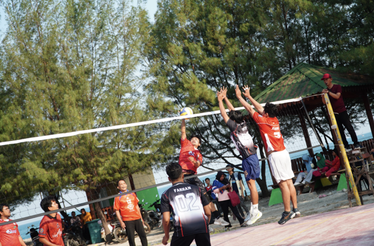
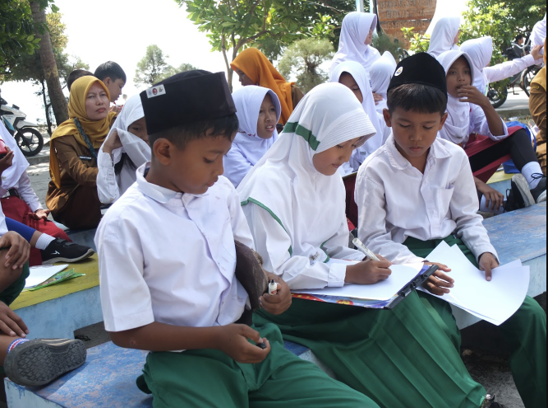
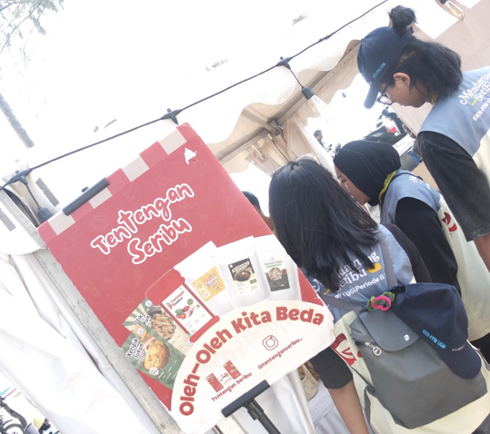
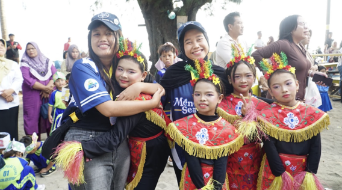

Pulau Tidung kembali diramaikan oleh rangkaian acara bertajuk **Tidung Ecofest 2026**, festival yang digagas Mahasiswa KKN-PPM UGM Mendayung Seribu. Mengusung semangat kepedulian lingkungan, festival ini menghadirkan beragam kegiatan mulai dari olahraga, edukasi anak, hingga bazar UMKM yang melibatkan seluruh warga pulau. Tidung Ecofest 2026 menjadi ajang yang mempertemukan kembali antusiasme warga dengan program pengabdian mahasiswa, sekaligus mempererat silaturahmi antara KKN-PPM UGM dan masyarakat Pulau Tidung.

## Lomba Voli Antar RW, Format Baru yang Jarang Digelar

Rangkaian Tidung Ecofest 2026 dibuka dengan lomba voli yang berlangsung pada 26 - 27 Juli 2026 di Lapangan Voli D’sah. Voli bukan olahraga asing bagi warga Pulau Tidung. Hampir setiap sore, lapangan voli ramai oleh warga, termasuk ibu-ibu yang rutin berlatih dan bertanding. Namun, kompetisi dengan format perwakilan tiap RW seperti yang digelar dalam Tidung Ecofest 2026 ini terbilang jarang, sehingga menjadi daya tarik tersendiri bagi warga.

Setiap RW, mulai dari RW 1 hingga RW 4, mengirimkan satu tim putra dan satu tim putri untuk bertanding memperebutkan gelar juara. Format ini pun bukan sepenuhnya baru bagi Pulau Tidung, namun sempat lama tidak diadakan sebelum akhirnya dihidupkan kembali tahun ini.

Shovia, salah satu Penanggung Jawab (PJ) lomba voli dari tim KKN-PPM UGM Mendayung Seribu, mengungkapkan antusiasme warga yang begitu tinggi menyambut kompetisi ini.

> "Antusiasme dari tiap RW luar biasa. Lomba voli ini memang bukan yang pertama kali diadakan di Pulau Tidung, tapi sempat lama vakum, jadi tahun ini jadi momen kebangkitan lagi buat warga. Selain jadi ajang olahraga, ini juga kesempatan mempererat kekompakan antar RW sekaligus mendukung suasana Ecofest yang mengusung semangat kebersamaan dan kepedulian lingkungan," ujar Shovia.

## LCC dan Kreasi Sampah, Edukasi Lingkungan untuk Generasi Muda

Pada 28 Juli 2026, giliran siswa-siswi sekolah dasar di Pulau Tidung yang unjuk kemampuan dalam dua kegiatan edukatif di Jembatan Cinta: **Lomba Cerdas Cermat (LCC)** untuk siswa kelas 4, 5, dan 6, serta **Lomba Kreasi Sampah** untuk siswa kelas 1, 2, dan 3.

Melalui LCC, siswa diajak menguji wawasan mereka dalam suasana kompetisi yang seru sekaligus edukatif. Sementara itu, Lomba Kreasi Sampah menjadi wadah bagi adik-adik kelas awal untuk belajar mengolah sampah menjadi karya bernilai, sekaligus menanamkan kesadaran akan pentingnya menjaga kebersihan lingkungan pulau sejak dini. Kegiatan ini sejalan dengan semangat besar Tidung Ecofest 2026 yang menempatkan isu lingkungan sebagai benang merah dari seluruh rangkaian acara.

Antusiasme siswa-siswi Pulau Tidung dalam mengikuti kedua lomba ini turut menghidupkan suasana Jembatan Cinta, salah satu ikon wisata pulau, yang pada hari itu berubah menjadi arena belajar sambil bermain bagi generasi muda setempat.

## Bazar UMKM, Kolaborasi dengan SUDIN PPKUKM Kepulauan Seribu

Rangkaian Tidung Ecofest 2026 ditutup dengan Bazar UMKM yang berlangsung selama dua hari, 28-29 Juli 2026, di Jembatan Cinta. Bazar ini merupakan hasil kolaborasi antara KKN-PPM UGM Mendayung Seribu dengan Suku Dinas Perindustrian, Perdagangan, Koperasi, Usaha Kecil dan Menengah (SUDIN PPKUKM) Kabupaten Administrasi Kepulauan Seribu.

Melalui bazar ini, para pelaku UMKM dari seluruh Kepulauan Seribu berkesempatan memamerkan dan memasarkan produk-produk unggulan mereka kepada wisatawan maupun warga lokal. Kolaborasi dengan SUDIN PPKUKM Kepulauan Seribu ini menjadi bentuk dukungan nyata terhadap pertumbuhan ekonomi kerakyatan di kawasan kepulauan, sekaligus memperkuat posisi Pulau Tidung sebagai destinasi wisata yang tak hanya kaya akan keindahan alam, tetapi juga produk lokal berkualitas.

## Lomba Menyanyi, Penutup yang Meriah dari Warga untuk Warga

Tak hanya soal olahraga dan edukasi, Tidung Ecofest 2026 juga menghadirkan sisi hiburan lewat Lomba Menyanyi antar RW. Perwakilan dari tiap RW unjuk suara dan tampil percaya diri di hadapan warga yang memadati lokasi acara, menjadikan lomba ini salah satu momen paling dinanti sekaligus penutup yang meriah dari rangkaian Ecofest.

Sorak-sorai dukungan dari warga terhadap perwakilan RW masing-masing menghadirkan suasana kekeluargaan yang hangat, sekaligus menunjukkan bagaimana seni dan musik masih menjadi bagian penting dalam kehidupan sosial masyarakat Pulau Tidung. Lomba ini menjadi pengingat bahwa di balik semangat pelestarian lingkungan yang diusung Ecofest, kebersamaan dan kegembiraan warga tetap menjadi inti dari setiap perayaan.

## Menyatukan Warga, Anak-anak, hingga Pelaku UMKM

Dari lapangan voli, Jembatan Cinta, hingga panggung lomba menyanyi, Tidung Ecofest 2026 berhasil menghadirkan rangkaian acara yang merangkul seluruh lapisan masyarakat Pulau Tidung, mulai dari warga dewasa, siswa sekolah dasar, hingga pelaku UMKM. Festival ini menjadi bukti nyata sinergi antara mahasiswa KKN-PPM UGM, warga, dan pemerintah daerah dalam menghidupkan kembali tradisi lokal sekaligus menumbuhkan kesadaran akan pentingnya menjaga kelestarian lingkungan Pulau Tidung.
